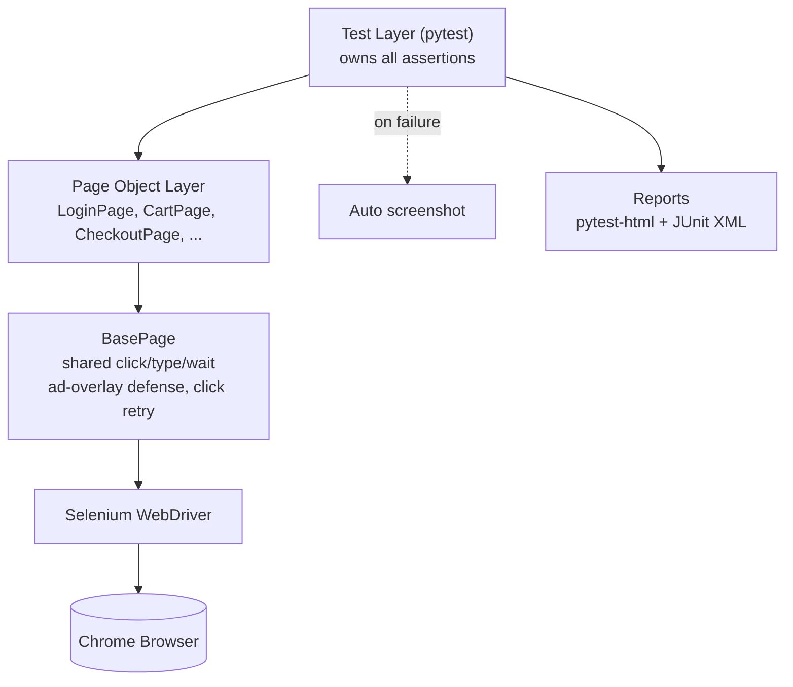

<div align="center">

# QA Automation Portfolio

**An end-to-end QA process — from requirements to CI failure notifications —
designed and automated with AI agents governed by explicit human approval
gates.**

[](https://github.com/Matthaeus888/qa-automation-portfolio/actions/workflows/ci.yml)


[](./LICENSE)

[한국어 README](./README.md) · [Defect Reports](./docs/defects/README.md) · [Troubleshooting](./docs/troubleshooting/) · [AI Agent Design](./docs/AI_AGENTS.md)

</div>

> Note: most of the underlying documents (PRD, Test Cases, Roadmap) are
> written in Korean, since this project was built for a Korean-market
> practice site. This README summarizes the project in English; the linked
> Korean documents are the full source of truth.

---

## Summary

- Designed and implemented a full QA process — **PRD → Test Case design →
  automation candidate selection → Roadmap → implementation → CI/CD → Slack
  notification** — for an e-commerce practice site
  ([automationexercise.com](https://automationexercise.com/)).
- Automated **76 test cases across 7 features** (login/logout, signup/account
  deletion, top navigation, product search, cart, product detail, page UI)
  using Selenium + pytest + the Page Object Model.
- Found **2 real production defects** while running the automated suite,
  investigated root cause, and documented them as formal defect reports —
  see [Defect Reports](./docs/defects/README.md).

## What This Project Demonstrates

| Area | What was done | Evidence |
|---|---|---|
| Requirements analysis / PRD writing | Verified real site behavior while writing 7 PRDs; corrected mismatches through a re-approval process | [docs/prd/](./docs/prd/) |
| Test case design | Quantified Priority via Impact × Likelihood risk scoring; suspected defects tracked separately | [docs/tc/](./docs/tc/) |
| Automation candidate selection | 6-axis scoring model (business criticality, regression frequency, stability, etc.) | [docs/tc/automation-candidates/](./docs/tc/automation-candidates/) |
| Test automation implementation | Selenium + pytest + POM, shared wait/retry logic abstracted into `BasePage` | [automation/](./automation/) |
| Defect discovery & analysis | 2 real production defects, each with reproduction steps, root cause, and rule-out reasoning | [docs/defects/](./docs/defects/) |
| CI/CD pipeline | GitHub Actions with push/schedule/manual triggers, headless Chrome, artifact upload | [.github/workflows/ci.yml](./.github/workflows/ci.yml) |
| Problem solving | Handled third-party ad overlay interception, a headless-only bug, and a CI conditional logic bug | [docs/troubleshooting/](./docs/troubleshooting/) |

## QA Process

```mermaid
flowchart LR
    A[Requirements] --> B[Write PRD]
    B -->|"Approval ✅"| C[Write Test Cases]
    C -->|"Automation scope approval ✅"| D[Write Roadmap]
    D --> E[Implement automation code]
    E --> F[Run tests & verify]
    F --> G[Code review]
    G -->|"Commit approval ✅"| H[Git Commit]
    H -->|"Push approval ✅"| I[Git Push]
    I --> J[GitHub Actions CI]
    J --> K[Slack notification]
```



Each ✅ marks a point where the pipeline stops until a human explicitly
approves — enforced through role-separated Claude Code Sub Agents. See
[docs/AI_AGENTS.md](./docs/AI_AGENTS.md) for the full design, including real
cases where an agent found a mismatch between an approved document and actual
site behavior and escalated for re-approval instead of silently "fixing" it.

## Architecture (Page Object Model)



## Defects Found

| ID | Title | Severity |
|---|---|---|
| [DEF-001](./docs/defects/DEF-001-logout-session-not-terminated.md) | Server session not terminated on `/logout`; user lands on Home still logged in | High |
| [DEF-002](./docs/defects/DEF-002-logout-server-error-disclosure.md) | Django debug error page exposed on `/logout` while logged out (information disclosure) | Medium |

## Test Coverage

| Feature | Approved TCs | Automated |
|---|---|---|
| Login / Logout | 11 | ✅ |
| Signup / Account Deletion | 11 | ✅ |
| Top Navigation | 6 | ✅ |
| Product Search | 8 | ✅ |
| Cart | 13 | ✅ |
| Product Detail | 6 | ✅ |
| Page UI | 21 | ✅ |
| **Total** | **76** | **79 pytest cases** (some TCs expand via parametrization) |

## Running Locally

```bash
cd automation
pip install -r requirements.txt
cp .env.example .env   # fill in ACTEST1~3_PASSWORD (never committed)

pytest tests/
pytest tests/test_login.py
```

## Tech Stack

| Item | Choice |
|---|---|
| Language | Python |
| Automation | Selenium WebDriver |
| Test runner | pytest |
| Design pattern | Page Object Model |
| Reporting | pytest-html + JUnit XML |
| CI/CD | GitHub Actions |
| Notifications | Slack (CI results only) |

## License

[MIT](./LICENSE)
