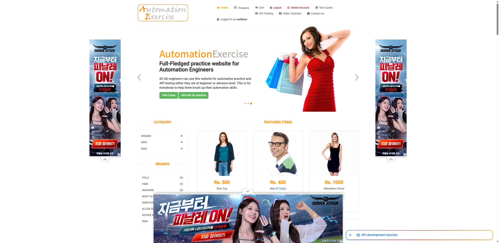

# DEF-001: `/logout` 접근 시 서버 세션이 종료되지 않고 로그인 상태로 Home에 랜딩

| 항목 | 내용 |
|---|---|
| 심각도 | High (보안/세션 관리) |
| 발견일 | 2026-08-31 (최초), 2026-09-15 (2차 경로로 재현) |
| 대상 | `https://automationexercise.com/logout` |
| 관련 TC | `TC-LOGIN-LOGOUT-014`, `TC-LOGIN-LOGOUT-015` ([docs/tc/login-logout.md](../tc/login-logout.md)) |
| 분류 | 실제 Product 문제 (`CLAUDE.md` 13절 기준) |
| 재현성 | 간헐적 (동일 세션에서도 매번 재현되지는 않음) |

## 증상

로그인 상태에서 로그아웃을 시도했을 때, 기대되는 동작은 "로그인 페이지(`/login`)로
이동하고 상단 네비게이션이 로그아웃 상태 메뉴로 전환"되는 것이다. 그러나 간헐적으로
아래와 같이 **로그아웃이 실제로는 처리되지 않는 현상**이 발생한다.

- URL은 `/logout` 요청 후 `/login`으로 이동하지 않고 Home(`/`)에 그대로 남는다.
- 상단 네비게이션에 `Logout` / `Delete Account` / `Logged in as {유저명}`이 로그아웃
  이후에도 계속 노출된다 — 즉 **서버 세션이 실제로는 종료되지 않았다.**

## 재현 절차

1. 유효한 계정으로 로그인한다.
2. 아래 두 경로 중 하나로 로그아웃을 시도한다.
   - 상단 네비게이션의 **"Logout"** 클릭 (`TC-LOGIN-LOGOUT-014`)
   - 브라우저 주소창에 `/logout` 직접 입력 (`TC-LOGIN-LOGOUT-015`)
3. 결과 화면을 확인한다.

## 기대 결과 vs 실제 결과

| 구분 | 기대 결과 | 실제 결과 |
|---|---|---|
| 이동 URL | `/login` | `/` (Home, 변경 없음) |
| 네비게이션 상태 | 로그아웃 상태 메뉴 (Signup/Login 노출) | 로그인 상태 메뉴 그대로 (`Logged in as {유저명}`) |
| 서버 세션 | 종료됨 | **종료되지 않음** |

## 증거

아래는 2026-09-15 `test_logout_via_top_navigation`(TC-014) 자동화 테스트 실행 중
Logout 클릭 직후 캡처된 실패 스크린샷이다. `Logged in as matthew`가 그대로 노출되고
있어 세션이 종료되지 않았음을 보여준다. 동일 세션에서 2회 연속 재현되었다.



## 근본 원인 추정

과거 조사(2026-08-31, Playwright MCP로 조회 전용 접근) 결과, 로그아웃 상태에서
`/logout`에 직접 접근했을 때 Django 서버가 아래와 같은 디버그 에러 페이지를 반환함을
확인했다(상세 재현은 [DEF-002](./DEF-002-logout-server-error-disclosure.md) 참고).

```
KeyError at /logout: 'user_id'
Exception Location: .../django/contrib/sessions/backends/base.py, line 72, in __delitem__
website/views.py, line 216, in logout: del request.session['user_id']
```

즉 서버의 `/logout` 뷰가 세션에서 `user_id` 키를 존재 여부 확인 없이 바로
`del request.session['user_id']`로 삭제를 시도하는데, 이미 키가 없는 상태(중복
로그아웃, 세션 만료 등 타이밍에 따라 발생)에서는 이 코드가 예외를 던지며 로그아웃
처리 자체가 완료되지 못한다. 이번(2026-09-15) 재현은 로그인 상태에서 상단 네비게이션
클릭으로 발생했다는 점에서, 클릭 시점의 세션 상태에 따라 같은 뷰 로직이 "정상 처리"와
"예외로 미완료" 사이를 오가는 것으로 추정된다 — 다만 이는 클라이언트에서 관찰 가능한
정보만으로 세운 가설이며, 서버 코드 확인 없이 확정할 수는 없다.

## 판정 근거

- 자동화 코드: 클릭 로직, Locator, Wait 처리 모두 정상 동작(같은 코드로 같은 세션 내
  다른 로그아웃 시도는 성공한 이력 있음).
- Test Data: 계정 정보 문제 아님(같은 계정으로 로그인 자체는 정상 성공).
- Test Environment: 로컬(headed)과 GitHub Actions(headless CI) 양쪽 모두에서 동일하게
  재현되어 특정 실행 환경의 문제가 아님을 확인.
- → 위 세 가지를 배제한 뒤, 서버 응답 자체가 세션을 종료하지 못하는 것으로 판단해
  **실제 Product 문제**로 분류.

## 대응 방침

- 이 결함을 이유로 관련 테스트(`test_logout_via_top_navigation`,
  `test_logout_via_direct_url`)의 Assertion을 완화하거나 실패를 자동으로 PASS 처리하지
  않는다 — 실제 결함이 존재하는 한 계속 FAILED로 정직하게 보고한다.
- 재발생할 때마다 매번 "이미 알려진 결함이니 PASS"로 넘기지 않고, 스크린샷/응답 상태로
  같은 원인인지 재확인한 뒤 기록한다.
- 서버 코드 수정은 이 프로젝트(자동화 테스트)의 범위 밖이다.
