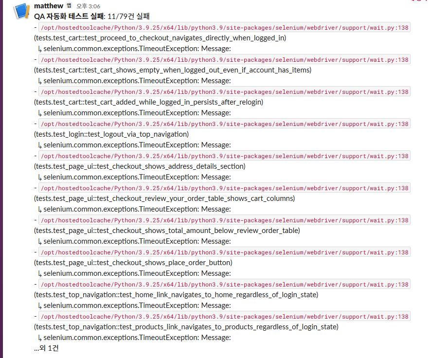

# 트러블슈팅: 새 저장소로 이전 후 CI가 계속 실패한 문제 (GitHub Secrets 재설정)

## 배경

기존 프로젝트 저장소를 포트폴리오용 새 저장소(`qa-automation-portfolio`)로 옮긴 뒤
push했더니, GitHub Actions CI가 **4회 연속 실패**했다. 로컬에서는 이미 여러 차례
전건 통과가 확인된 동일한 테스트 스위트였기 때문에, 코드 문제가 아니라 새 저장소의
설정 문제일 가능성이 높다고 보고 원인을 좁혀나갔다.

## 진단 과정 (제한된 정보로 원인 좁히기)

이 저장소에 대한 GitHub API 관리자 권한 토큰이 없어, `Run automation tests` 스텝의
**전체 로그 원문을 직접 조회할 수 없었다**(`403 Must have admin rights to
Repository.`). 대신 아래처럼 인증 없이도 조회 가능한 간접 정보를 조합해 원인을
좁혀나갔다.

1. **스텝별 성공/실패(conclusion)** — `GET /actions/runs/{id}/jobs`로 각 스텝이
   성공/실패/건너뜀(skipped)인지는 인증 없이 조회 가능했다. `Notify Slack on
   failure` 스텝이 계속 `skipped`인 것을 보고, 그 스텝의 실행 조건
   (`env.SLACK_WEBHOOK_URL != ''`)이 거짓이라는 것 — 즉 `SLACK_WEBHOOK_URL`
   시크릿이 비어있다는 것을 역으로 추론했다.
2. **실행 소요 시간** — 초기 실패들은 몇십 초 만에 끝났다(테스트 스위트를 거의 돌지
   못하고 즉시 실패). 이는 "테스트 로직 자체의 문제"보다는 "테스트를 시작하기도 전에
   막히는 문제"(예: 필수 환경변수 부재로 인한 즉시 예외)를 의심하게 하는 신호였다.
3. **Checks API의 annotations** — `Process completed with exit code 1`처럼 제한적인
   정보만 얻을 수 있었고, 결정적 단서는 되지 못했다.
4. **최종적으로는 사용자가 직접 캡처한 로그 텍스트**가 정확한 원인을 확인하는 데
   결정적이었다: `RuntimeError: ACTEST1_PASSWORD 환경변수가 설정되지 않았습니다`.

## 근본 원인

두 가지가 겹쳐 있었다.

### 1) GitHub Secrets는 저장소별로 독립적이다

기존 저장소에 등록해 둔 `ACTEST1~3_PASSWORD`, `SLACK_WEBHOOK_URL` 4개 시크릿은
**새 저장소로 자동 이전되지 않는다.** 저장소를 옮기거나 새로 만들 때는 시크릿을
매번 다시 등록해야 한다 — 당연해 보이지만, 기존 저장소에서 이미 정상 동작하던 CI를
그대로 복사해왔다는 인식 때문에 처음에는 놓치기 쉬운 부분이었다.

### 2) 시크릿 등록 시 Name/Value를 분리하지 않고 합쳐서 입력

1차 재등록 시도에서, GitHub의 "New repository secret" 폼(Name 칸과 Secret 값 칸이
분리되어 있음)에 아래처럼 **이름과 값이 밑줄로 합쳐진 문자열을 통째로 이름 칸에
입력**하는 실수가 있었다.

| 잘못 등록된 이름 | 워크플로우가 참조하는 실제 이름 |
|---|---|
| `ACTEST1_PASSWORD_matthew` | `ACTEST1_PASSWORD` |
| `SLACK_WEBHOOK_URL_https://hooks.slack.com/...` | `SLACK_WEBHOOK_URL` |

워크플로우는 `${{ secrets.ACTEST1_PASSWORD }}`처럼 **정확히 일치하는 이름**만
참조하므로, 이름이 다른 시크릿은 존재하지 않는 것과 같다 — 값이 조용히 빈 문자열로
치환되고, `automation/config/accounts.py`가 이를 감지해 명시적으로
`RuntimeError`를 발생시켰다(이 명시적 예외 처리 덕분에 원인을 "값이 없다"는
것까지는 비교적 빠르게 좁힐 수 있었다).

한 가지 혼란을 더한 요인: 시크릿을 수정하려고 다시 열어보면 **값 칸이 항상
비어있게 보이는데, 이는 GitHub이 보안상 저장된 값을 절대 다시 보여주지 않기
때문**이다(정상 동작). 이 때문에 "값이 사라진 것 아니냐"는 의심이 들 수 있지만,
실제 문제는 값이 아니라 **이름**이었다.

## 해결

1. 잘못된 이름의 시크릿을 삭제한다.
2. **New repository secret**으로 다시 만들되, Name 칸에는 정확히
   `ACTEST1_PASSWORD`(접미사 없이)만, Secret 값 칸에는 실제 비밀번호만 입력한다.
3. `git commit --allow-empty`로 빈 커밋을 만들어 push하면 `on: push` 트리거로 CI를
   즉시 재실행해 수정 결과를 바로 검증할 수 있다(코드 변경 없이 CI만 재실행하고
   싶을 때 유용).

수정 후 재실행 결과, `RuntimeError`는 완전히 사라졌고(로그인 관련 시크릿이 이제
정상 인식됨), `Notify Slack on failure` 스텝도 `skipped`가 아니라 실제로
실행되어 실패 요약이 Slack으로 도착하는 것까지 확인했다.

## 남은 이슈 (의도적으로 보류)

같은 실행에서 11/79건이 `selenium.common.exceptions.TimeoutException`으로
실패했다. 로그인 상태를 전제로 하는 테스트들에 몰려 있었지만, 이 스위트는
과거 로컬/CI 양쪽에서 79/79 전건 통과 이력이 있어 **코드 결함이 확정된 것은
아니다.** 제3자 광고 오버레이 개입이나 실제 프로덕션 사이트의 일시적 응답
지연([ad-overlay.md](./ad-overlay.md), [flaky-tests.md](./flaky-tests.md) 참고)에
의한 1회성 플레이키일 가능성이 있어, **재현성을 확인하기 전까지는 결함으로
단정하지 않고 보류**했다(CLAUDE.md 13절 — 원인 불명확 시 추측으로 결론짓지
않는다는 원칙).

## Slack 알림 (최종 확인 증거)

수정된 CI가 실제로 실행되어 Slack으로 실패 요약을 보낸 화면이다 — 이 알림 자체가
"시크릿 문제는 해결되었고, CI 파이프라인이 의도한 대로 실패 시 요약과 함께
알림을 보낸다"는 것의 증거다.

